# Lab7Web-Database-Use

# PHP-CodeIgniter

This project is an assignment from my class
#### NIM : 312110103
#### Kelas : TI.21.A2
#### MatKul : Pemrograman Web 2


### Membuat Database
```
CREATE DATABASE lab_ci4;
```
### Membuat Tabel
```
CREATE TABLE artikel (
 id INT(11) auto_increment,
 judul VARCHAR(200) NOT NULL,
 isi TEXT,
 gambar VARCHAR(200),
 status TINYINT(1) DEFAULT 0,
 slug VARCHAR(200),
 PRIMARY KEY(id)
);
```
### Setting File Database
Pertama Setting code database di app/Config/Database.php atau kalian bisa juga di file .env
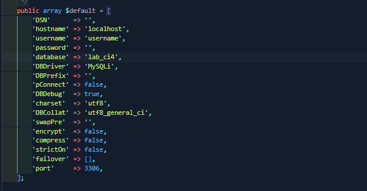

### Controller
Buat Controller baru dengan nama Artikel.php pada direktori app/Controllers
### View
Buat direktori baru dengan nama artikel pada direktori app/views, kemudian buat file baru dengan 
nama index.php.
### Tampilan
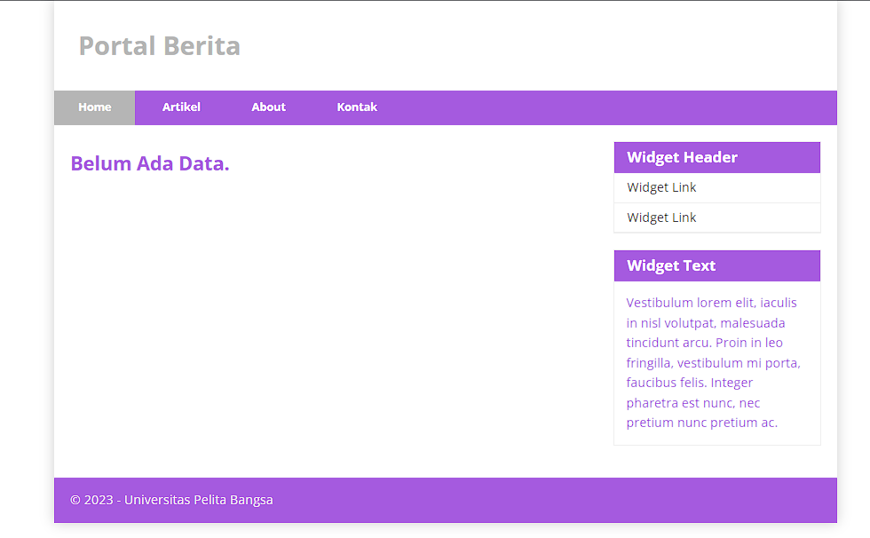
### SQL
Tambahkan kode di dalam Sql
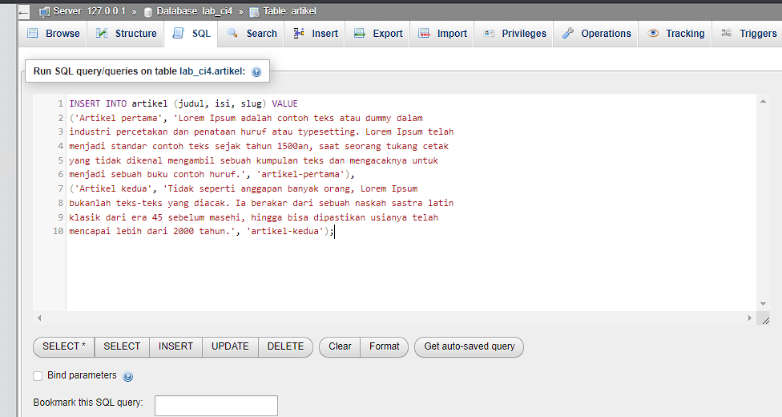
```
INSERT INTO artikel (judul, isi, slug) VALUE
('Artikel pertama', 'Lorem Ipsum adalah contoh teks atau dummy dalam 
industri percetakan dan penataan huruf atau typesetting. Lorem Ipsum telah 
menjadi standar contoh teks sejak tahun 1500an, saat seorang tukang cetak 
yang tidak dikenal mengambil sebuah kumpulan teks dan mengacaknya untuk 
menjadi sebuah buku contoh huruf.', 'artikel-pertama'), 
('Artikel kedua', 'Tidak seperti anggapan banyak orang, Lorem Ipsum 
bukanlah teks-teks yang diacak. Ia berakar dari sebuah naskah sastra latin 
klasik dari era 45 sebelum masehi, hingga bisa dipastikan usianya telah 
mencapai lebih dari 2000 tahun.', 'artikel-kedua');
```
### Hasil
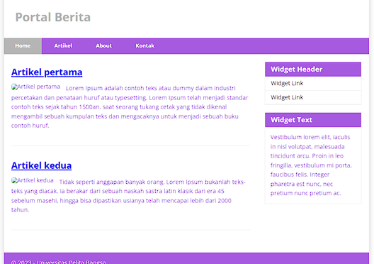
### Membuat Routing untuk artikel detail
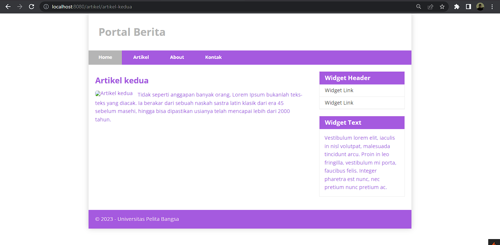
### Membuat Menu Admin
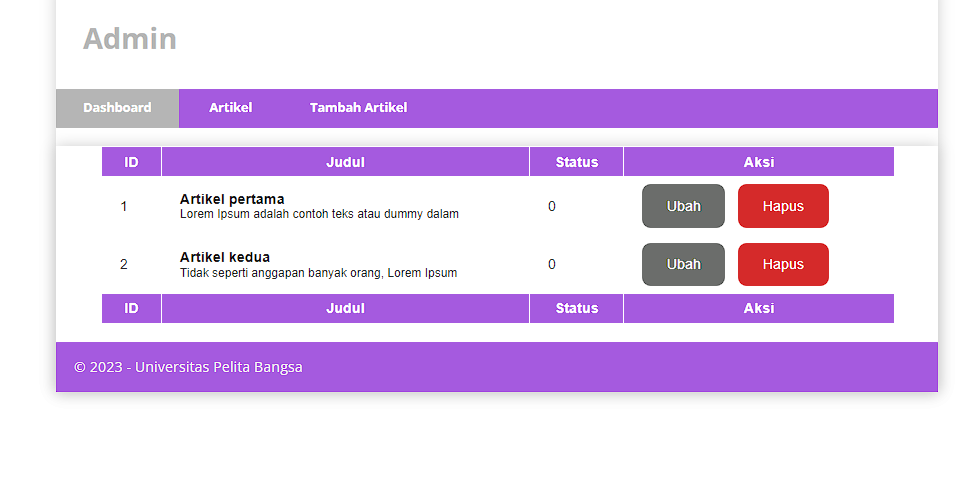
### Menambah Data Artikel
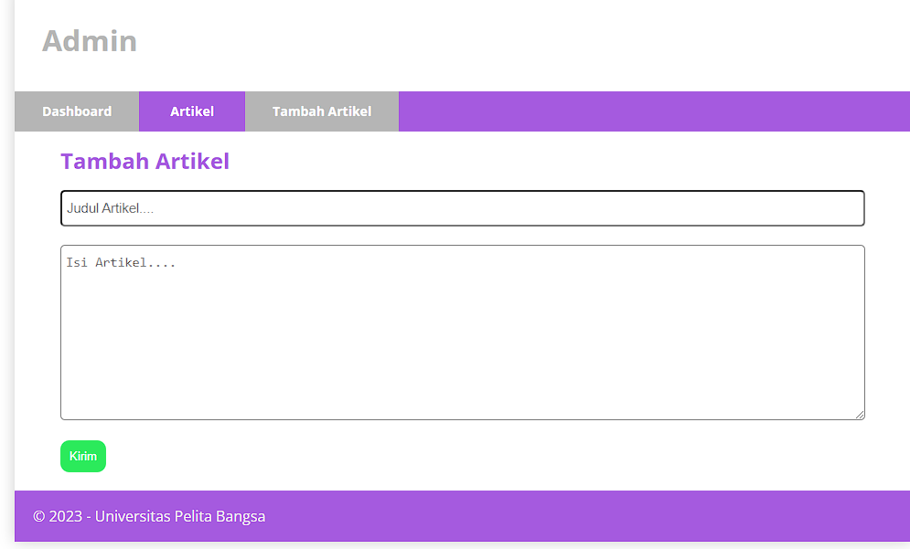
### Hasil
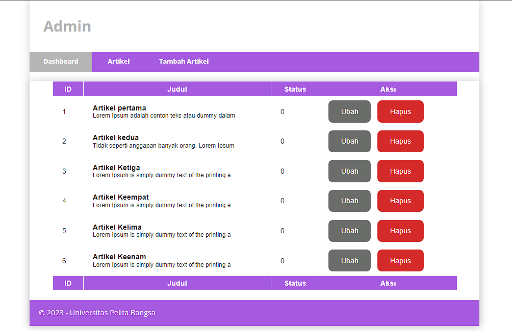
### Fungsi Form Edit
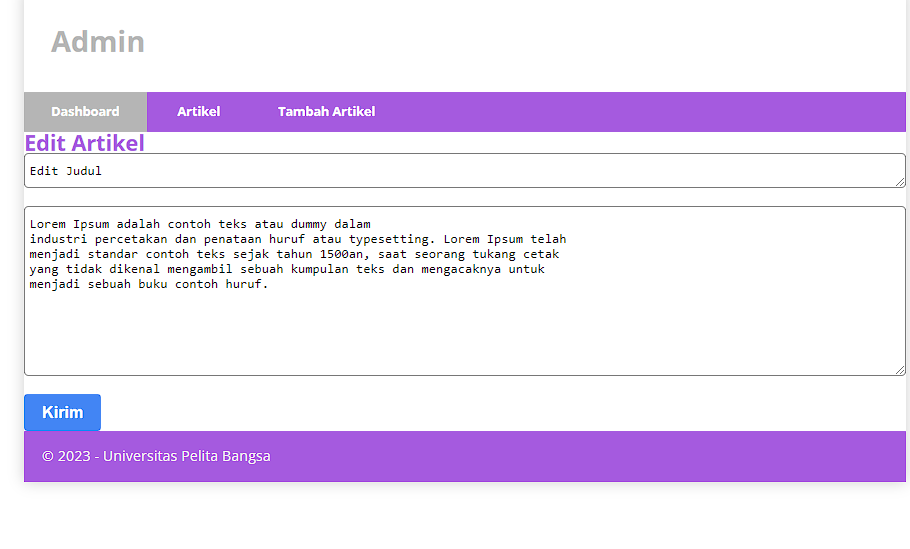
### Hasil Form Edit
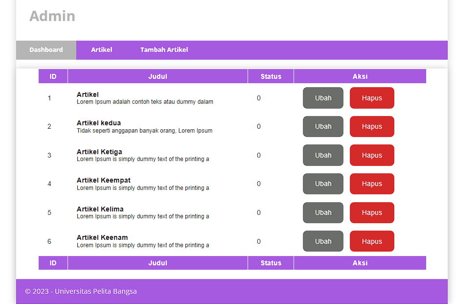
### Test Button Hapus
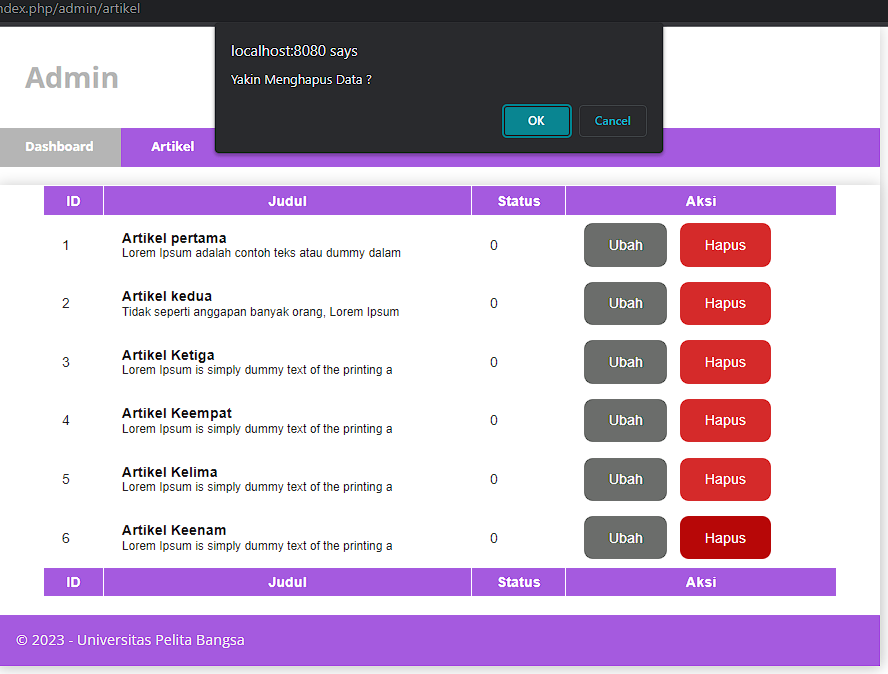